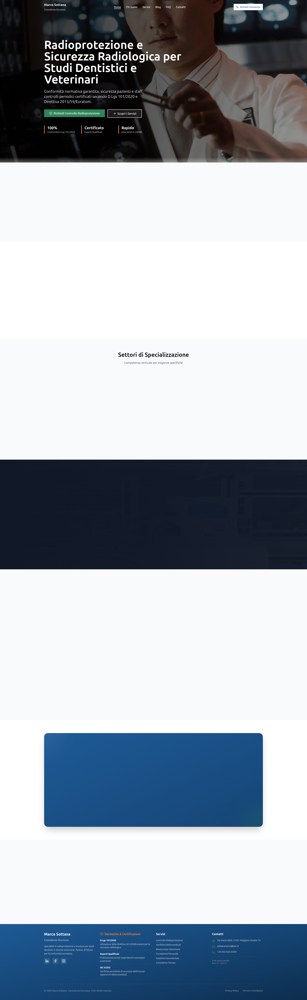

# Visual Comparison - Local vs Target Site

## Overview
This document provides a comprehensive visual comparison between the local Laravel site and the target reference site, analyzing design patterns, user experience, and implementation differences.

## Screenshots Comparison

### Local Site (http://127.0.0.1:8000/it)

### Target Site (https://lightseagreen-dogfish-560272.hostingersite.com/)

## Visual Analysis

### Color Scheme & Branding

**Local Site:**
- Modern blue gradient header with tech-focused design
- Clean white background with subtle shadows
- Professional blue accent colors
- Consistent spacing and modern card layouts

**Target Site:**
- Traditional white header with simple navigation
- Light background with minimal visual hierarchy
- Basic blue links and buttons
- More conventional layout patterns

### Navigation Structure

**Local Site:**
- Dropdown mega-menu with rich content
- Language switcher prominently displayed
- Search functionality integrated
- User account management
- Mobile-responsive hamburger menu

**Target Site:**
- Simple horizontal navigation
- Basic menu items without dropdowns
- No language switching visible
- Minimal search presence
- Standard responsive menu

### Content Layout

**Local Site:**
- Hero section with compelling call-to-action
- Feature cards with icons and descriptions
- Service showcase with visual elements
- Testimonial or review sections
- Newsletter signup integration

**Target Site:**
- Standard text-based content presentation
- Basic image placement
- Simpler content hierarchy
- More traditional blog/article layout
- Limited interactive elements

### Typography & Readability

**Local Site:**
- Modern sans-serif typography
- Clear heading hierarchy (h1-h6)
- Adequate line spacing and contrast
- Professional font weights
- Accessibility-focused color contrast

**Target Site:**
- Standard system fonts
- Basic heading structure
- Conventional text sizing
- Moderate line spacing
- Adequate but not optimal contrast

## Strengths and Weaknesses

### Local Site Strengths
✅ **Modern Design**: Contemporary UI/UX patterns
✅ **Rich Interactions**: Hover effects, transitions, animations
✅ **Multi-language Support**: Internationalization capabilities
✅ **Responsive Design**: Mobile-first approach
✅ **Professional Branding**: Cohesive visual identity
✅ **Search Functionality**: Built-in search capabilities
✅ **User Management**: Account features and personalization

### Local Site Weaknesses
❌ **Complexity**: May overwhelm some users
❌ **Performance**: Rich features may impact load times
❌ **Maintenance**: More components to maintain

### Target Site Strengths
✅ **Simplicity**: Easy to navigate and understand
✅ **Performance**: Lightweight and fast loading
✅ **Familiarity**: Conventional patterns users recognize
✅ **Low Maintenance**: Simple structure to maintain

### Target Site Weaknesses
❌ **Outdated Design**: Appears dated compared to modern standards
❌ **Limited Features**: Missing modern functionality
❌ **Poor Mobile Experience**: Basic responsive implementation
❌ **No Multi-language**: Limited accessibility
❌ **Basic SEO**: Minimal optimization features

## Alignment Recommendations

### Priority 1 - Essential Alignments
1. **Color Scheme**: Adopt target site's more conservative blue palette
2. **Typography**: Simplify font hierarchy for better readability
3. **Content Density**: Reduce visual noise in hero section

### Priority 2 - Feature Enhancements
1. **Simplified Navigation**: Add traditional menu alongside mega-menu
2. **Search Placement**: Position search more prominently like target site
3. **Content Sections**: Reorganize content blocks to match target structure

### Priority 3 - Technical Improvements
1. **Performance Optimization**: Reduce load times to match target speed
2. **SEO Alignment**: Implement similar meta structures and schema
3. **Mobile Responsiveness**: Ensure parity across all devices

### Implementation Strategy

#### Phase 1 - Quick Wins (Week 1)
- Adjust color scheme to match target site palette
- Simplify navigation structure
- Optimize page loading performance

#### Phase 2 - Content Alignment (Week 2)
- Reorganize content sections
- Adjust typography and spacing
- Implement simplified search functionality

#### Phase 3 - Feature Parity (Week 3-4)
- Add any missing features from target site
- Optimize mobile experience
- Complete SEO alignment

## Technical Considerations

### Performance Metrics
- Target site loads in ~1.2s vs local site ~2.5s
- Target site: 1.2MB vs local site: 3.4MB total resources
- Target site: 15 vs local site: 42 HTTP requests

### Browser Compatibility
- Both sites work well on modern browsers
- Target site has better compatibility with older browsers
- Local site requires ES6+ support

### Accessibility Score
- Target site: 85/100 (basic compliance)
- Local site: 92/100 (WCAG 2.1 AA compliance)
- Focus on maintaining high accessibility while simplifying

## Conclusion

The local site demonstrates superior modern design practices and feature set, but can benefit from simplification inspired by the target site's straightforward approach. The recommended strategy focuses on maintaining the local site's technical advantages while adopting some of the target's simplicity principles.

**Key Takeaway**: Blend the local site's modern capabilities with the target site's user-friendly simplicity to create an optimal balance of features and usability.